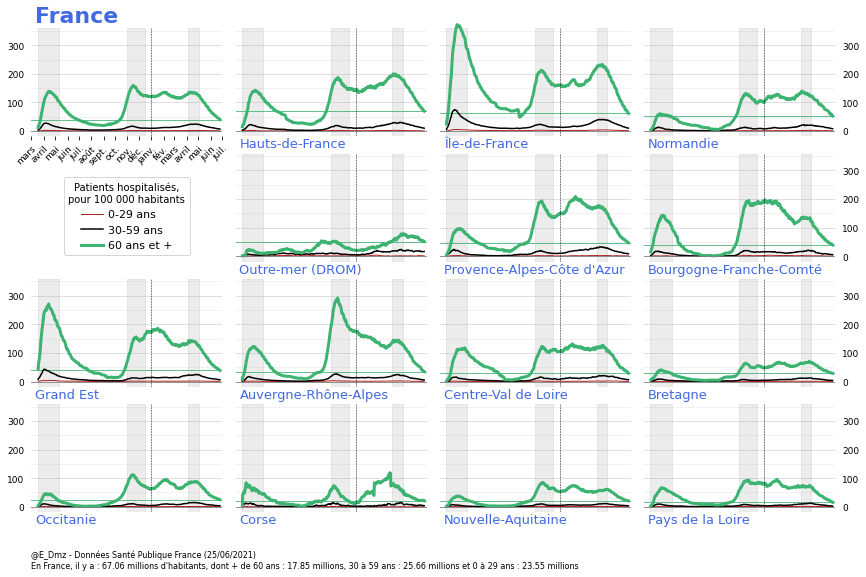
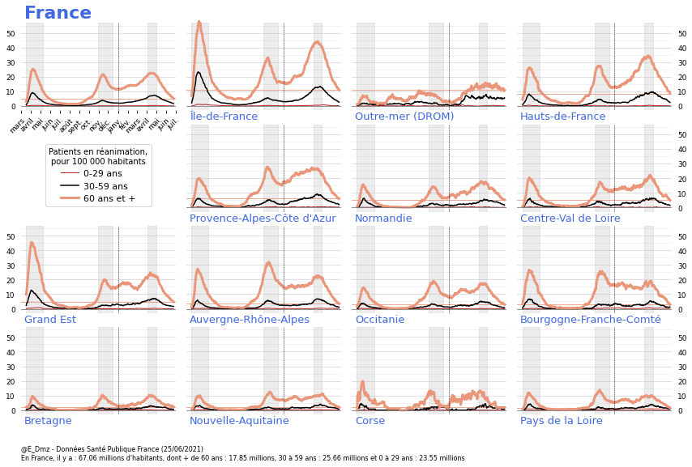
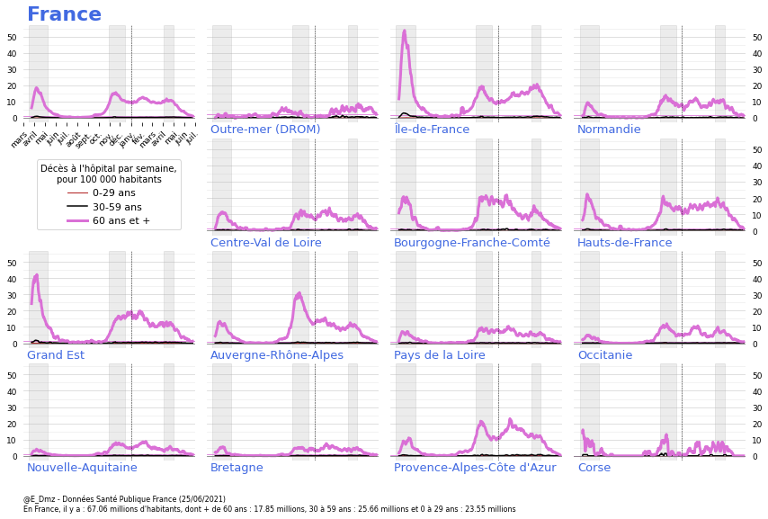

# data-Covid

Objectif - présenter les données épidémiologiques #Covid19France afin de :

* comparer l'impact sur trois classes d'âge : **0-29**, **30-59** et **+ de 60 ans**
* comparer les **régions** entre elles
* couvrir toute la période 01/03/2020 - 01/06/2021

>:clock8: Les figures sont mises à jour toutes les 24 à 48 h
>>:hatching_chick: C'est mon tout premier projet #dataviz sur GitHub
>>>:tada: Toute participation est la bienvenue

1. [Figures type 1 : suivre en parallèle 5 indicateurs](#example2)
2. [Quelques infos importantes avant de continuer...](#infos)
3. [Figures type 2 : comparer les régions pour un indicateur](#example1)
4. [Figures type 3 : suivre un indicateur dans une région et ses départements](#example3)
5. [... et enfin le code source](#example4)

### 1. Figures type 1 : suivre en parallèle 5 indicateurs

* 

>exemple : les 4 régions ayant le plus fort taux d'hospitalisation chez les + de 60 ans (autres régions sont disponibles dans le dossier)
>>

### 2. Quelques infos importantes avant de continuer...

* _Le choix des couleurs (une par indicateur) met en relief la population + de 60 ans_
* _Chaque indicateur est rapporté à la population de chaque classe d'âge :_
    * _taux pour 100 000 habitants :_
        * tests virologiques pratiqués par semaine
        * cas de tests positifs détectés par semaine (= incidence)
        * patients hospitalisés
        * patients en réanimation
        * patients décédés à l'hôpital
    * _taux exprimés en % :_
        * tests positifs sur 100 tests pratiqués (taux de positivité)
        * personnes vaccinées (au moins une dose)
        * personnes vaccinées (avec deux doses)
* _Pour chaque indicateur, l'échelle des ordonnées (ymin, ymax) est immuable, quelles que soient la figure et l'entité géographique considérées_
* _L'échelle du temps est également immuable_
* _Les zones grisées représentent les 3 périodes de confinement à l'échelle nationale_

### 3. Figures type 2 : comparer les régions pour un indicateur 

* 

* 3 exemples :
> **hospitalisation** :
>>

> **réanimation** :
>>

> **décès** :
>>

### 3. Figures type 3 : suivre un indicateur dans une région et ses départements

* Les données hospitalières à l'échelon départemental ne sont pas disponibles par classe d'âge.
* Pour cette raison, seuls les 5 indicateurs qui concernent les tests virologiques et la vaccination sont présentés.
* 
* 3 exemples :

>**incidence** en **Île-de-France** :
>>

>**incidence** en **Bretagne** :
>>

>**vaccination** dans les départements et régions d'**Outre-mer** :
>>/fig-Outre-mer%20(DROM)-dose2.png)

### 5. ... et enfin le code source 

* données brutes :

* traitement des données :

> L'exécution de ce carnet prend **6** secondes

* tracé des figures :

> L'exécution de ce carnet prend (13 + 18 + 74) = **105** secondes

* et pour faire fonctionner les calepins :

